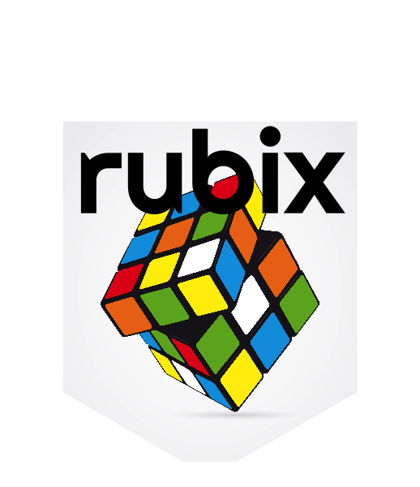

# rubix   

<a href="https://www.vecteezy.com/free-vector/rubiks-cube">Rubiks Cube Vectors by Vecteezy</a>  

## Installation  
```
devtools::install_github("meerapatelmd/rubix")  
```  

## Code of Conduct
  
  Please note that the rubix project is released with a [Contributor Code of Conduct](https://contributor-covenant.org/version/2/0/CODE_OF_CONDUCT.html). By contributing to this project, you agree to abide by its terms.

